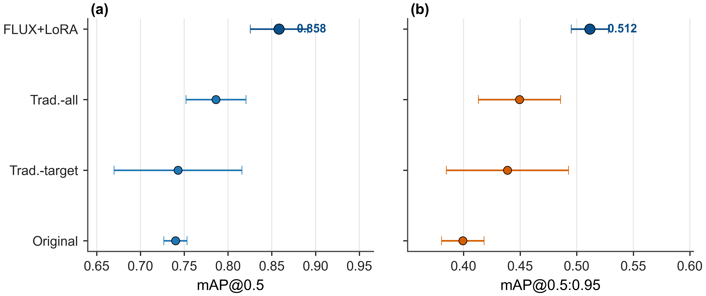
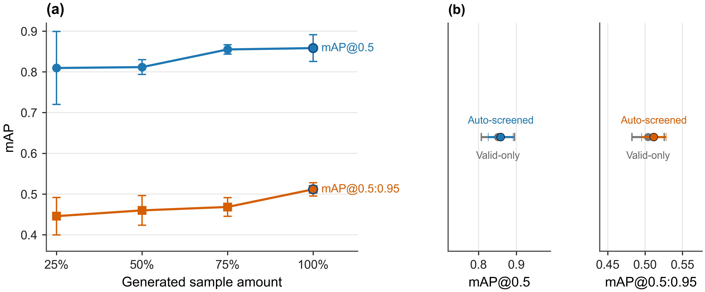
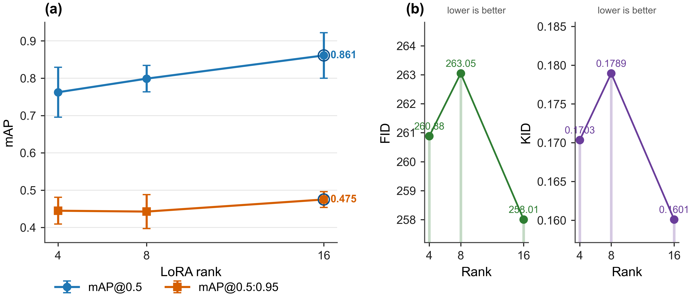
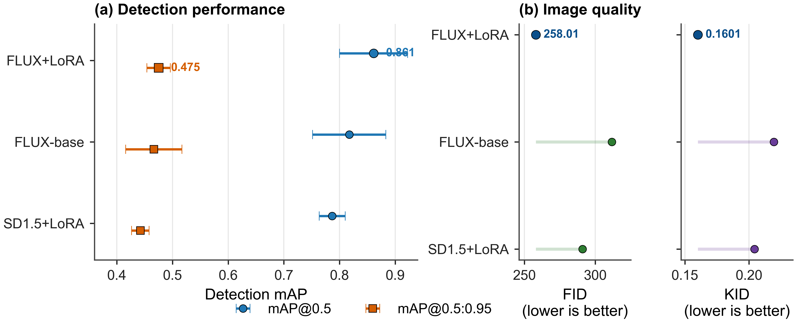

# Sonar-FLUX-LoRA-Augmentation

<p align="center">
  <strong>Diffusion-Model-Based Data Augmentation for Target Detection in Side-Scan Sonar Images</strong>
</p>

<p align="center">
  Code, configurations, result tables, plotting scripts, and reproducibility documentation for FLUX+LoRA-based synthetic side-scan sonar data augmentation.
</p>

<p align="center">
  <a href="https://www.kaggle.com/datasets/yangyuanxu/sonar-flux-synthetic">
    
  </a>
  
  
  
  
</p>

---

## Overview

This repository accompanies the manuscript:

> **Diffusion-Model-Based Data Augmentation for Target Detection in Side-Scan Sonar Images**

The project investigates whether synthetic side-scan sonar images generated by a FLUX+LoRA model can improve target detection under a fixed-detector and real-only validation/test protocol. The released repository focuses on reproducibility assets: dataset documentation, YOLO configuration templates, screening utilities, evaluation utilities, result tables, and figure-generation scripts.

The synthetic dataset itself is released separately on Kaggle:

**Dataset:** [Synthetic Side-Scan Sonar FLUX+LoRA](https://www.kaggle.com/datasets/yangyuanxu/sonar-flux-synthetic)

The original real side-scan sonar images used in the manuscript are **not redistributed** due to data-licensing restrictions.

---

## Highlights

* **Synthetic sonar dataset release**: 2380 generated side-scan sonar images with YOLO-format annotations are publicly available on Kaggle.
* **Fixed-detector evaluation protocol**: all detection experiments use YOLOv8n to isolate the contribution of data augmentation/generation.
* **Real-only validation/test protocol**: augmented or generated samples are added only to the training set.
* **Screening transparency**: label auditing and quality screening procedures are documented.
* **Reproducible tables and figures**: result CSVs and plotting scripts are provided for the main quantitative figures.
* **Clear scope**: real sonar images and FLUX/LoRA model weights are not redistributed in this release.

---

## Dataset

The released Kaggle dataset contains only synthetic/generated side-scan sonar images and YOLO-format labels.

| Subset                       | Description                                                                                                                   | Images | Labels |
| ---------------------------- | ----------------------------------------------------------------------------------------------------------------------------- | -----: | -----: |
| `flux_lora_16_auto_screened` | FLUX+LoRA rank-16 generated subset selected by label auditing and quality screening; used in the main augmentation experiment |   1780 |   1780 |
| `flux_lora_16_manual_600`    | Manually annotated generated subset used for controlled LoRA-rank and diffusion-backbone comparison experiments               |    600 |    600 |

Target classes:

| Class ID | Class name |
| -------: | ---------- |
|        0 | body       |
|        1 | plane      |
|        2 | ship       |

Dataset link:

```text
https://www.kaggle.com/datasets/yangyuanxu/sonar-flux-synthetic
```

The dataset includes:

```text
flux_lora_16_auto_screened/
├── images/
└── labels/

flux_lora_16_manual_600/
├── images/
└── labels/

metadata/
├── file_manifest.csv
├── generation_metadata.csv
└── screening_metadata.csv
```

---

## Main Results

All detection experiments use a fixed YOLOv8n detector and unchanged real-only validation/test sets.

| Training setting        |           Precision |              Recall |             mAP@0.5 |        mAP@0.5:0.95 |
| ----------------------- | ------------------: | ------------------: | ------------------: | ------------------: |
| Original                |     0.7156 ± 0.0909 |     0.6305 ± 0.0535 |     0.7400 ± 0.0132 |     0.3994 ± 0.0187 |
| Traditional-target-only |     0.7524 ± 0.1669 |     0.7042 ± 0.0606 |     0.7428 ± 0.0731 |     0.4388 ± 0.0540 |
| Traditional-all         |     0.8425 ± 0.0835 |     0.7248 ± 0.0629 |     0.7862 ± 0.0343 |     0.4495 ± 0.0363 |
| FLUX+LoRA auto-screened | **0.8505 ± 0.0674** | **0.8185 ± 0.0445** | **0.8582 ± 0.0328** | **0.5115 ± 0.0164** |

Compared with the original real-only training setting, the FLUX+LoRA auto-screened setting improves:

* mAP@0.5 by **+0.1182**
* mAP@0.5:0.95 by **+0.1121**

Compared with the stronger Traditional-all baseline, it improves:

* mAP@0.5 by **+0.0720**
* mAP@0.5:0.95 by **+0.0620**

---

## Visual Results

### Main detection comparison

<p align="center">
  
</p>

### Generated-sample and screening ablation

<p align="center">
  
</p>

### LoRA-rank sensitivity

<p align="center">
  
</p>

### Diffusion-backbone comparison

<p align="center">
  
</p>

---

## Repository Structure

```text
sonar-flux-lora-augmentation
├── README.md
├── LICENSE
├── CITATION.cff
├── requirements.txt
├── configs/
│   ├── detection_original.yaml
│   ├── detection_traditional_target_only.yaml
│   ├── detection_traditional_all.yaml
│   ├── detection_flux_lora_auto_screened.yaml
│   ├── detection_flux_lora_manual_600.yaml
│   └── generation_flux_lora_rank16.yaml
├── prompts/
│   └── sonar_prompt_templates.json
├── scripts/
│   ├── download_kaggle_dataset.py
│   ├── label_audit.py
│   ├── build_selected_subset.py
│   ├── train_yolov8n.py
│   ├── eval_yolov8n.py
│   ├── compute_fid_kid.py
│   ├── plot_figure3_main_comparison.py
│   ├── plot_figure6_ablation.py
│   ├── plot_figure7_lora_rank.py
│   └── plot_figure8_backbone.py
├── results/
│   ├── table3_main_detection_results.csv
│   ├── table4_ablation_results.csv
│   ├── table5_lora_rank_results.csv
│   └── table6_backbone_results.csv
├── figures/
│   ├── figure3_main_comparison.png
│   ├── figure6_ablation.png
│   ├── figure7_lora_rank.png
│   └── figure8_backbone.png
└── docs/
    ├── dataset_description.md
    ├── reproduction_guide.md
    ├── screening_protocol.md
    ├── kaggle_dataset.md
    └── limitations.md
```

---

## Installation

Clone the repository:

```bash
git clone https://github.com/yanzhi0526/sonar-flux-lora-augmentation.git
cd sonar-flux-lora-augmentation
```

Create a Python environment:

```bash
conda create -n sonar-flux python=3.10 -y
conda activate sonar-flux
```

Install dependencies:

```bash
pip install -r requirements.txt
```

---

## Download the Synthetic Dataset

The dataset is hosted on Kaggle. After configuring your Kaggle API credentials, run:

```bash
python scripts/download_kaggle_dataset.py \
  --dataset yangyuanxu/sonar-flux-synthetic \
  --output ./datasets
```

Alternatively, download it manually from:

```text
https://www.kaggle.com/datasets/yangyuanxu/sonar-flux-synthetic
```

---

## Label Audit

To verify image-label consistency and YOLO-format annotations:

```bash
python scripts/label_audit.py \
  --image-dir ./datasets/sonar-flux-synthetic/flux_lora_16_auto_screened/images \
  --label-dir ./datasets/sonar-flux-synthetic/flux_lora_16_auto_screened/labels \
  --classes body plane ship \
  --output ./audit_auto_screened.csv
```

The audit script checks:

* missing label files;
* empty label files;
* invalid class IDs;
* invalid YOLO bounding boxes;
* image-level and object-level class distributions.

---

## Training YOLOv8n

Example command:

```bash
python scripts/train_yolov8n.py \
  --data configs/detection_flux_lora_auto_screened.yaml \
  --seed 42 \
  --epochs 200 \
  --imgsz 640 \
  --project runs/flux_lora_auto_screened
```

Important note:

The real validation and test images used in the manuscript are not redistributed. Therefore, exact reproduction of the manuscript detection metrics requires access to the original real side-scan sonar validation/test sets. The provided configuration files use placeholder validation/test paths and should be adapted to the user's own real sonar dataset.

---

## Evaluation

```bash
python scripts/eval_yolov8n.py \
  --weights runs/flux_lora_auto_screened/weights/best.pt \
  --data configs/detection_flux_lora_auto_screened.yaml \
  --imgsz 640
```

---

## Plotting Manuscript Figures

The result CSV files in `results/` can be used to reproduce the quantitative figures:

```bash
python scripts/plot_figure3_main_comparison.py
python scripts/plot_figure6_ablation.py
python scripts/plot_figure7_lora_rank.py
python scripts/plot_figure8_backbone.py
```

Generated figures will be saved to `figures/`.

---

## Screening Protocol

The generated samples used in the main experiment were selected through two steps:

1. **Label auditing**

   * check label-file existence;
   * remove missing labels;
   * remove empty labels;
   * remove invalid class IDs;
   * remove invalid YOLO bounding boxes.

2. **Quality screening**

   * clear target structure;
   * plausible target-highlight/acoustic-shadow relationship;
   * consistent seabed background appearance;
   * reliable bounding-box annotation.

Screening statistics:

| Item                                  | Number |
| ------------------------------------- | -----: |
| Raw generated images                  |   2317 |
| Valid candidates after label audit    |   2079 |
| Final screened samples                |   1780 |
| Acceptance rate from raw generation   | 76.82% |
| Acceptance rate from valid candidates | 85.62% |

See [`docs/screening_protocol.md`](docs/screening_protocol.md) for details.

---

## Prompt Templates

The prompt templates follow the design principle:

```text
category semantics + sonar imaging structure + style trigger words
```

Example prompt:

```text
side-scan sonar image of a shipwreck with bright highlight and dark acoustic shadow on seafloor background
```

Prompt templates are provided in:

```text
prompts/sonar_prompt_templates.json
```

---

## What Is Not Released

This repository intentionally does not include:

* original real side-scan sonar images;
* real training/validation/test splits;
* FLUX base model weights;
* trained LoRA adapter weights;
* detector checkpoints;
* training caches or experiment logs.

The trained LoRA adapter is not included in the current release due to base-model licensing and data-governance considerations. This release instead provides the generated synthetic dataset, annotations, metadata, screening protocol, evaluation scripts, result tables, and figure-generation utilities.

---

## Limitations

* The released images are synthetic/generated samples and may not cover all real-world sonar imaging conditions.
* The original real sonar validation/test images are not redistributed, so exact reproduction of the reported real-only detection metrics requires access to the original real dataset.
* Some seed-level generation metadata may be incomplete.
* The repository provides code and configuration templates, but users may need to adapt paths and training settings to their local environment.
* The LoRA adapter weights are not released in the current version.

See [`docs/limitations.md`](docs/limitations.md) for a more detailed discussion.

---

## License

The repository code is released under the MIT License.

The Kaggle dataset is released under **CC BY-NC-SA 4.0** and is intended for academic research and non-commercial use. Users are responsible for ensuring that their use complies with applicable model, dataset, institutional, and third-party restrictions.

---

## Citation

If you find this repository or dataset useful, please cite the paper and dataset:

```bibtex
@misc{yang2026sonarfluxlora,
  title        = {Diffusion-Model-Based Data Augmentation for Target Detection in Side-Scan Sonar Images},
  author       = {Yang, Yuanxu and Zhang, Tao},
  year         = {2026},
  note         = {Code and synthetic dataset release},
  url          = {https://github.com/yanzhi0526/sonar-flux-lora-augmentation}
}
```

Dataset:

```text
https://www.kaggle.com/datasets/yangyuanxu/sonar-flux-synthetic
```

---

## Acknowledgements

This repository is provided to support transparency and reproducibility for synthetic side-scan sonar data augmentation research. The FLUX base model is not redistributed. Users should obtain any required base models from their official sources and follow the corresponding license terms.
